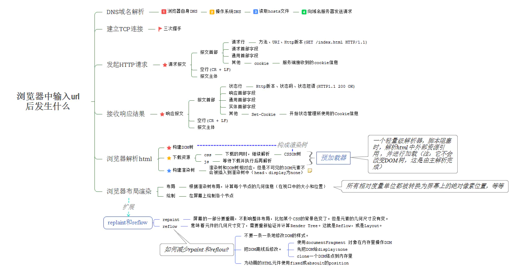

# Web通信协议

## 网络模型OSI

| OSI中的层    | 功能                                   | TCP/IP协议族                                      |
| ------------ | -------------------------------------- | ------------------------------------------------- |
| 7-应用层     | 文件传输，电子邮件，文件服务，虚拟终端 | TFTP，**HTTP**，SNMP，FTP，SMTP，DNS，Telnet 等等 |
| 6-表示层     | 数据格式化，代码转换，数据加密         | 没有协议                                          |
| 5-会话层     | 解除或建立与别的接点的联系             | 没有协议                                          |
| 4-传输层     | 提供端对端的接口                       | **TCP，UDP**                                      |
| 3-网络层     | 为数据包选择路由                       | **IP**，ICMP，OSPF，EIGRP，IGMP                   |
| 2-数据链路层 | 传输有地址的帧以及错误检测功能         | SLIP，CSLIP，PPP，MTU                             |
| 1-物理层     | 以二进制数据形式在物理媒体上传输数据   | ISO2110，IEEE802，IEEE802.2                       |

## DNS协议

DNS协议的作用是将域名解析为IP

## IP/TCP协议

IP协议：是用来查找地址，对应网际互联层

TCP、UCP协议：是用来规范传输规则的，对应传输层

IP只负责找到地址，具体怎么传输是由TCP、UCP来完成

### TCP与UDP的区别

1. TCP是需要连接的传输协议（长连接），UDP是不需要连接的传输协议；
2. TCP对系统资源要求较多，UDP要求较少；
3. TCP的程序结构较复杂，UDP程序结构较简单；
4. TCP是流模式，UDP是数据报模式 ；
5. TCP保证数据正确性，UDP可能丢包，TCP保证数据顺序，UDP不保证。

## Http协议（应用层协议） ##

+ http协议构建于TCP/IP协议上，应用层协议，默认端口号80

+ http协议特点

  + 支持C/S模式（客户/服务器模式）

  + 简单快速

  + 灵活

  + **无连接**：限制每次连接只处理一个请求。<u>请求时建连接、请求完释放连接</u>，

 优点：尽快将资源释放出来服务其他客户端；缺点：在加载多个数据时会变慢，

 解决：<u>Keep-Alive 功能使客户端到服务器端的连接持续有效</u>，当出现对服务器的后继请求时，避免了建立或者重新建立连接

  + **无状态**：无状态是指协议对于事务处理没有记忆能力，服务器不知道客户端是什么状态。即我们给服务器发送 HTTP 请求之后，<u>服务器根据请求响应完毕，不会记录任何信息</u>。

 优点：减少不必要占用；缺点：传输重复内容

 解决：Cookie保持信息到用户下次与服务器的会话；Session通过服务器保存状态

## URI

> 参考：https://juejin.im/post/5e76bd516fb9a07cce750746

### URI简介

**URI**全称为(Uniform Resource Identifier)，中文名**统一资源标识符**，用以区分互联网上不同的资源

其下有两个子集：

+ **URN**-统一资源名：指示某网络资源的名称，定义资源身份
+ **URL**-统一资源定位符：指示某网络资源的地址，提供寻找该资源的方法**（常说的网址）**

### URI组成

.webp)

+ **scheme** 表示协议名，比如`http`, `https`, `file`等等。后面必须和`://`连在一起。
+ **user:passwd@** 表示登录主机时的用户信息，不过很不安全，不推荐使用，也不常用。
+ **host:port**表示主机名和端口。
+ **path**表示请求路径，标记资源所在位置。
+ **query**表示查询参数，为`key=val`这种形式，多个键值对之间用`&`隔开。
+ **fragment**表示 URI 所定位的资源内的一个**锚点**（页面中的书签），浏览器根据锚点跳转到页面对应的位置。

### URI编码

URI只支持使用`ASCII`，并且有部分界定符被保留不能使用

需要使用非`ASCII`字符和界定符原本的意思时，编码为**`%`加上两位十六进制字节**

#### ```encodeURI()```和 ```decodeURI()```

函数操作的是完整的 URI；

函数假定 URI 中的任何保留字符都有特殊意义，所有不会编码它们

```js
encodeURI(" ")	//"%20"
encodeURI("中文")	//"%E4%B8%AD%E6%96%87"
decodeURI("%E4%B8%AD%E6%96%87")	//中文
```

#### ```encodeURIComponent()``` 和```decodeURIComponent ()```

函数操作的是组成 URI 的个别组件（被包含于URI1中的URI2，URI2中所有的保留字符都被视为普通字符）；

函数假定任何保留字符都代表普通文本，所以必须编码它们，所以它们（保留字符）出现在一个完整 URI 的组件里面时不会被解释成保留字符了。


## Http报文

以ASCII码传输，请求分为状态行、消息头和消息主体

### 报文种类 ###

+ 请求报文（Request）：
  + 请求行：请求行（包括请求类型，URL和Http版本）
  + 请求头：冒号分隔的键值对属性，节选如下：
    + Accept：客户端接收响应的类型（文本，图片之类）
    + Cookie
    + Referer：该请求来源URL
    + Cache-Control：控制缓存信息
  + 请求体：Post类型请求的参数

---

+ 响应报文（Response）：
  + 响应行：状态行（Http版本，状态码和剪短原因）
  + 响应头：冒号分隔的键值对属性
    + Cache-Control ：告诉客户端对返回内容的缓存操作（做不做取决于C端）
    + ETag：描述服务端资源是否发生变化
    + Location：服务端返回另一个url要求客户端重新访问
    + Set-Cookie：服务端设置客户端Cookie
  + 响应体：返回页面结果

### Accept 系列字段

> 参考：https://juejin.im/post/5e76bd516fb9a07cce750746

#### 数据格式

+ 请求端：`Accept`，希望收到特定类型的数据（但是不强制要求类型，作提示之用）
+ 响应端：`Content-Type`，发送数据的类型
+ 常见取值
  + 文本格式`text`：
    + `text/plain`：纯文本格式
    + `text/html`：HTML 格式
    + `text/css`：CSS 格式
    + `text/xml`：一种使用 HTTP 作为传输协议，XML 作为编码方式的远程调用规范
  + 图像格式`image`： `image/gif`,`image/jpeg`,`image/png`
  + 多媒体格式`audio、video`：`audio/video`,`video/mp4`
  + 应用格式`application`：`application/json`，`application/javascript`，`application/pdf`，`application/octet-stream`
    + `application/x-www-form-urlencoded`：浏览器原生from组件提交
    + `application/json`：序列化后的JSON字符串
  + `multipart/form-data`：常见的 POST 数据提交的方式。我们使用表单上传文件时，必须让`<form>`的`enctyped`属性等于这个值
+ `charset=UTF-8`：也可以设置语言编码，和数据格式编码同时放在`Content-Type`中，用`;`分割

#### 压缩方式

+ 请求端：`Accept-Encoding`，表示希望接收的压缩方式
+ 响应端：`Content-Encoding`，表示数据采用的压缩方式
+ 常见取值
  + gzip：当今最流行的压缩格式
  + deflate：另外一种著名的压缩格式
  + br：一种专门为 HTTP 发明的压缩算法

#### 支持语言

+ 请求端：`Accept-Language`
+ 响应端：`Content-Language`，指定受支持的语言
+ 可以指定多种语言，用`,`隔开

#### 字符集

+ 请求端：`Accept-Charset`
+ 响应端：**没有对应属性**，用`Content-Type`中的`charset`属性指定；表示字符集


### 请求行类型

参见 [HTTP 请求端法](https://developer.mozilla.org/zh-CN/docs/Web/HTTP/Methods)

+ **GET：GET方法请求一个指定资源的表示形式，使用GET的请求应该只被用于获取数据。**
+ **POST：POST方法用于将实体提交到指定的资源，通常导致在服务器上的状态变化或副作用** 。
+ HEAD：HEAD方法请求一个与GET请求的响应相同的响应，但没有响应体。
+ PUT：PUT方法用请求有效载荷替换目标资源的所有当前表示。
+ DELETE：DELETE方法删除指定的资源。
+ CONNECT：CONNECT方法建立一个到由目标资源标识的服务器的隧道。
+ OPTIONS：OPTIONS方法用于描述目标资源的通信选项。
+ TRACE：TRACE方法沿着到目标资源的路径执行一个消息环回测试。
+ PATCH：PATCH方法用于对资源应用部分修改。

---

**GET与POST的区别:**

GET用于数据获取的请求，保证安全性和<u>幂等性（对同一 URL 的多个请求应该返回同样的结果）</u>

POST用于可能修改服务器资源的请求

一般区别：

+ G使用URL或cookie传参，P使用body
+ G长度有限制，P的数据可以很大（这是因为浏览器对于URL长度的限制，而非http协议规定）
+ P的数据地址栏不可见，更安全

**终极区别：G在网络不佳时可能进行多次尝试请求，所以不能用作对资源的修改**

### 状态码类型

+ 1XX：消息性状态
  + 100：要求C端继续发送消息
  + 101：收到请求，但要求C端更换协议
  + 102：请求将继续执行
+ 2XX：成功状态
  + 200：成功！
  + 201：请求已响应并新建文件（上传文件时）
  + 202：收到请求（不一定响应），多用于等待异步操作结束前发送
  + 204：请求已响应，但无内容返回
+ 3XX：重定向状态
  + 301：永久性重定向，资源已更新URI
  + 302：暂时性重定向，此次使用新URI
  + 304：以前的缓存可以使用
+ 4XX：客户端错误状态
  + 400：请求错误，如语法错误、URI拼写错误
  + 401：需要授权，多出现于需要登陆的界面
  + 403：请求被拒绝
  + 404：服务器找不到对应的资源，URI不存在
+ 5XX：服务器错误状态
  + 500：服务器内部错误
  + 502：网关错误（服务器作为代理，从上游服务器收到无效响应）
  + 503：服务器崩溃
  + 504：网关超时（上游服务器响应超时）

## 浏览器输入网址后…

1. 域名解析
   1. 首先检查浏览器自身DNS
   2. 检查操作系统DNS
   3. 检查本地hosts文件（Window系统路径：`C:\Windows\System32\drivers\etc\hosts`）
   4. 请求域名服务器
2. 建立TCP连接
3. 发起Http请求-请求报文
4. 接收响应结果-响应报文
5. 浏览器解析Html
6. 浏览器渲染布局



## 浏览器如何解析Html(webkit)

> 参考：https://juejin.im/post/6844903745730396174

### Html解析顺序

+ 解析html以构建dom树：dom解析具有顺序性与渐进性
  + 顺序性：从上至下依次按行解析
  + 渐进性：解析多少就显示多少
+ 构建render树：解析css文件（读取css标签时，从右到左）
+ 布局、绘制render树
  + reflow(回流)：浏览器计算盒模型位置、大小，元素的尺寸变化时触发
  + repain(重绘)：绘制元素
  + 应该尽可能少的减少reflow和repain，节省加载开支

---

### **dom树解析时遇到外联资源**

dom解析完成后，`document`对象派发`DOMContentLoaded`事件，是为dom解析完成的标志与时间点

按照请求时机，外联资源分为两类：

+ 阻塞型：阻塞dom树解析完成，请求完才会派发`DOMContentLoaded`事件
  + 内联css
  + 内联javascript
  + 外联普通javascript
  + 外联defer javascript
  + javascript标签之前的外联css：之后的js需要依赖这些外联css（如修改）
+ 非阻塞型：不阻塞dom树解析完成，可以用`window.onload`来判断这些资源是否加载完成
  + javascript标签之后的外联css
  + image
  + iframe
  + 外联async javascript
    + js已经下载完成，dom还没解析完：阻塞解析并开始解析
    + js还没下载完，dom已经解析完：不阻塞直接派发`DOMContentLoaded`事件；**所以在async的js中监听`DOMContentLoaded`事件可能会失败**

> 这也是`DOMContentLoaded`事件和`window.onload`的不同之处
>
> 前者标志dom解析和阻塞资源加载完成，后者标志全部静态资源加载完成

### 外联JavaScript的引用时序

`<script>`、`<script async>`与`<script defer>`，推荐使用`<script defer>`

延迟脚本并不一定会按照顺序执行，也不一定会`在DOMContentLoaded`事件触发前执行，因此最好只包含一个延迟脚本

